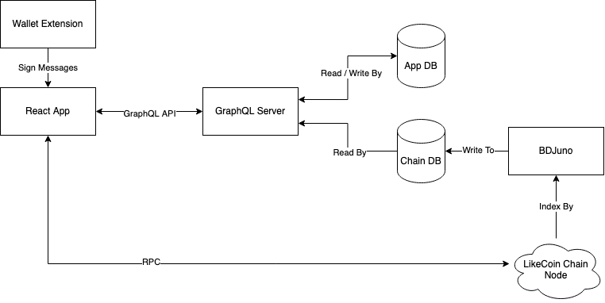

# Architecture

## Tech Stack

| Module         | Tech              |
| -------------- | ----------------- |
| Web App        | React, Typescript |
| GraphQL Server | Golang, GraphQL   |
| Database       | PostgreSQL        |
| Deployment     | Kubernetes, Helm  |

## Discussion

The architecture objective is to provide an excellent end-user experience in browsing and operating on cosmos chain data. To achieve this, it is challenging if not impossible to rely only on cosmos-sdk native API. Therefore an indexer and middle GraphQL server layer was introduced to provide more flexibility in querying and caching. This is especially true for historical data, as most validators or RPC nodes are not set up as archival nodes, so old data is not queryable.

We do not proxy everything, especially for user interactions that involve on-chain data, to reduce attack vectors. The rationale for which kinds of requests are handled by the server, and which are not, will be explained in the following sections.

## GraphQL API vs RPC

As depicted, there are two main APIs consumed by the React App: GraphQL and Chain RPC.

### Actions handled by GraphQL API

- Chain queries that require indexing
  - i.e. Queries that involves search and filtering
  - e.g. Validators, Votes, Comments via ISCN
- Queries / Mutations for off-chain features
  - e.g. Reactions
  - Data of off-chain features are kept by the server. Users are required to authenticate by signing an off-chain message. User session is kept by signed cookies issued by server.

### Actions handled by Chain RPC

- Chain data that relates to a specific user
  - e.g. Account balance, Delegations, Staking Rewards
- Chain data that requires lower latency
  - e.g. Current block number
- Submitting on-chain transactions

## On-chain vs Off-chain Features

### On-chain Features

- Governance Features
  - e.g. Voting, Delegation, Submitting proposals
- Proposal Comments, Discussion Board
  - Posts and comments are submitted on-chain as an ISCN record

### Off-chain Features

- Reactions to proposals, posts and comments
  - Emoji reactions by authenticated users are kept by server off-chain

## Authentication for Off-chain Features

We referenced [EIP-4361 (Sign-In with Ethereum)](https://eips.ethereum.org/EIPS/eip-4361) to implement a sign-in flow that requires users to proof wallet ownership by signing a challenge message off-chain.

Cookies signed with HMAC-SHA256 is issued by server to keep authenticated user session for 24 hours.

## External Modules

[BDJuno by Forbole](https://github.com/forbole/bdjuno/) is deployed as an indexer to crawl on-chain data onto chain database for quick queries.

A likecoin-chain specific branch is submoduled at `/bdjuno`
